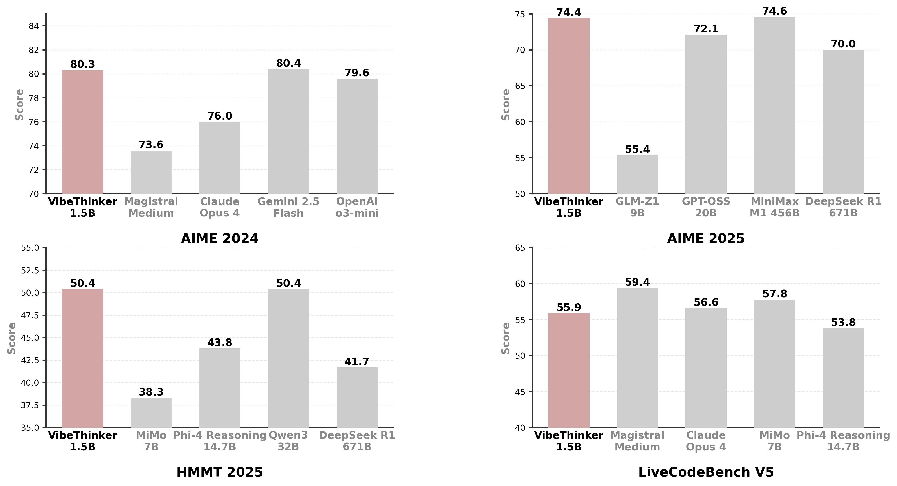
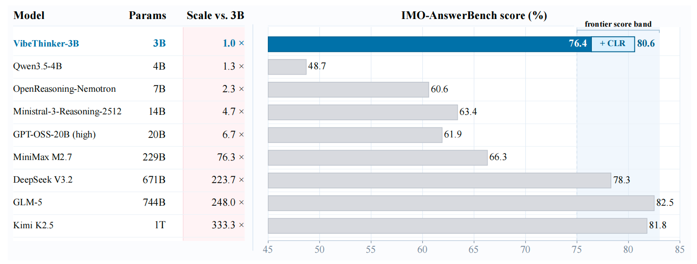
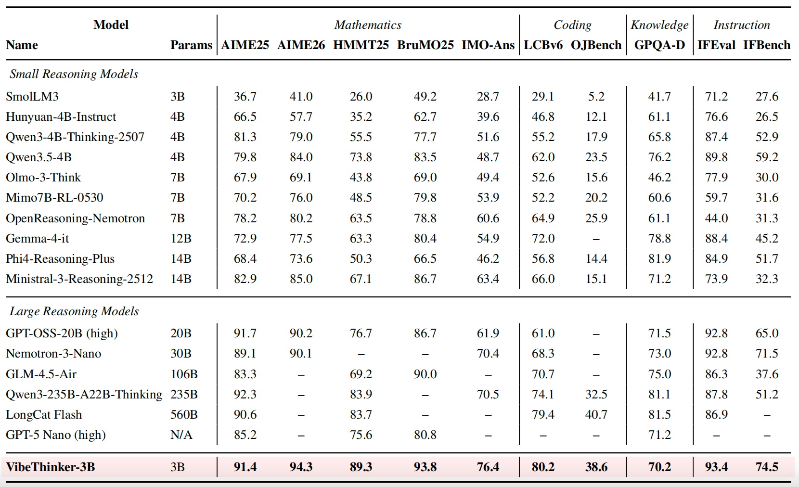
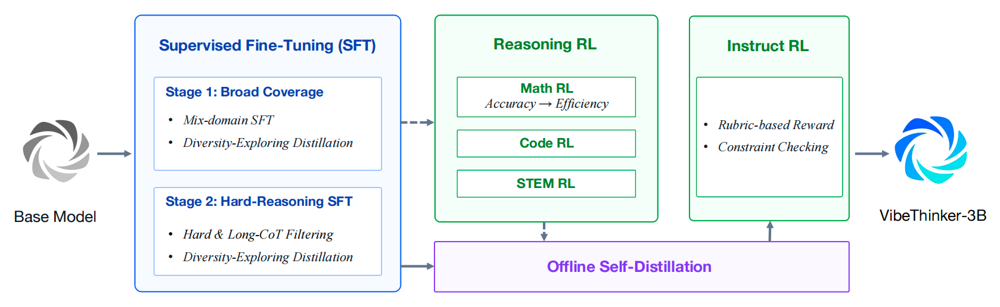
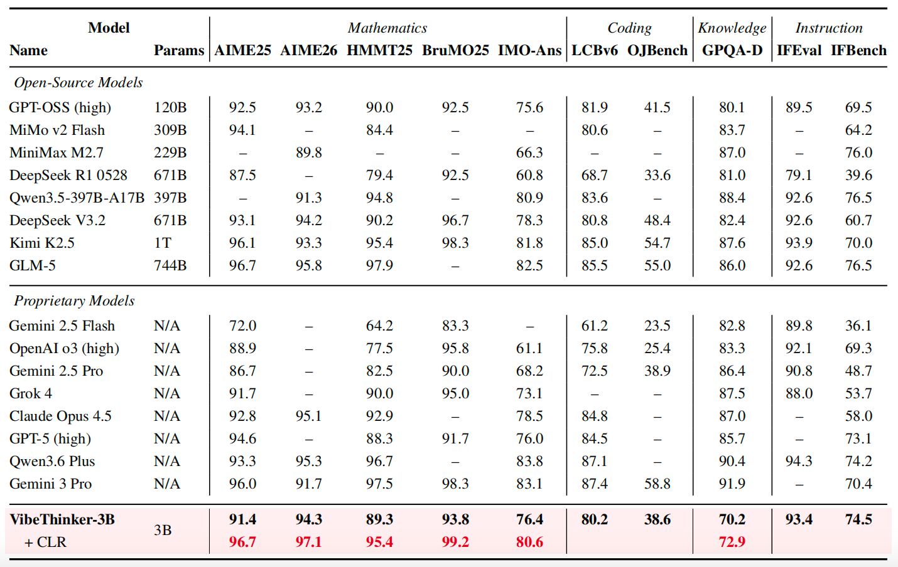
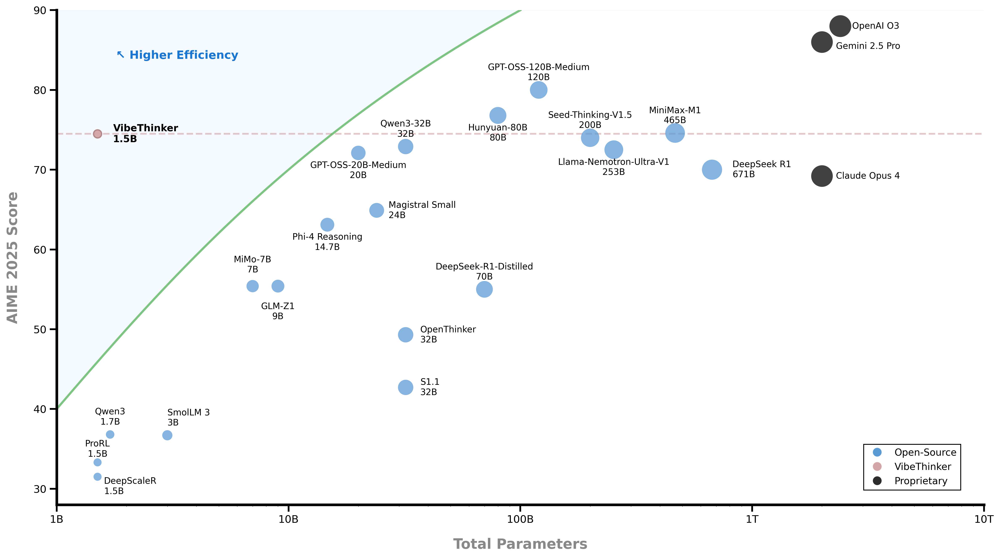
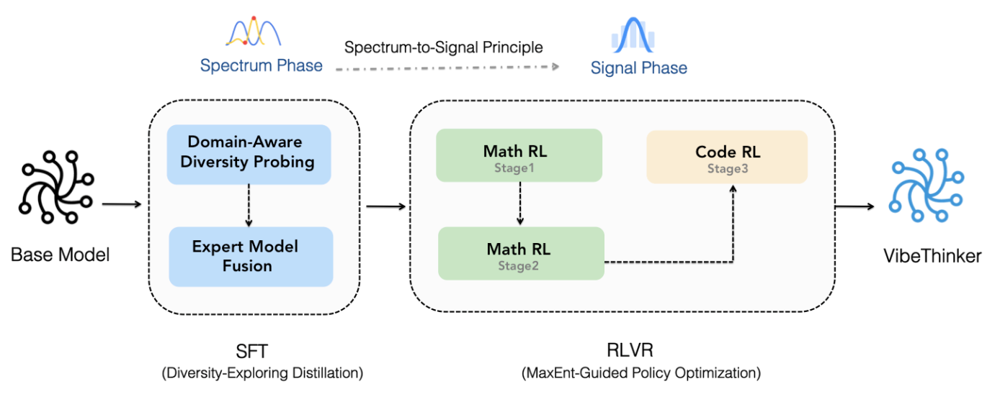
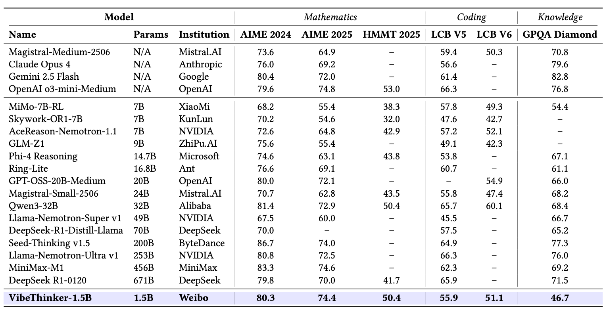
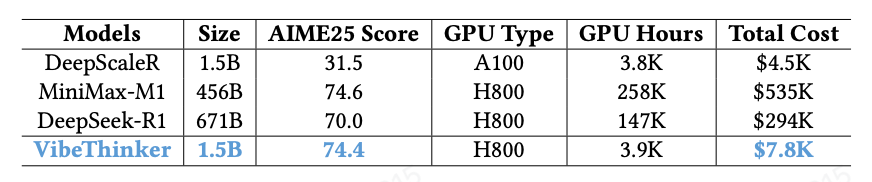

# VibeThinker
<p align="center"></p>

<p align="center">🤗 <a href="https://huggingface.co/WeiboAI">Hugging Face</a>&nbsp&nbsp | &nbsp&nbsp🤖 <a href="https://modelscope.cn/organization/WeiboAI">Model Scope</a></p>

## Reports & Papers

| Model | Technical Report | Paper |
| --- | --- | --- |
| VibeThinker-3B | TODO: add 3B technical report link | <a href="https://arxiv.org/pdf/2606.16140">arXiv Paper</a> |
| VibeThinker-1.5B | <a href="https://huggingface.co/papers/2511.06221">Technical Report</a> | <a href="https://arxiv.org/abs/2511.06221">arXiv Paper</a> |

## News

[2026.06.16] 🎉🎉🎉 VibeThinker-3B is now released! The model weights and technical report are available from the links above.

[2025.11.19] 🔥🔥VibeThinker-1.5B hit #1 on huggingface’s trending models today!

[2025.11.11] 🎉🎉🎉 VibeThinker-1.5B is now open source! The model weights and technical report can be accessed via the links at the top.

[2025.11.05] 📢📢📢 VibeThinker-1.5B will be open-sourced soon. Stay tuned!

## Introduction

### VibeThinker-3B

VibeThinker-3B is a 3-billion-parameter dense reasoning model developed to explore how far verifiable reasoning can be pushed within a strictly small-model regime. It is built upon **Qwen2.5-Coder-3B** and post-trained with an upgraded Spectrum-to-Signal pipeline that combines curriculum-based supervised fine-tuning, multi-domain reinforcement learning, offline self-distillation, and instruction-oriented reinforcement learning.

The model is designed for tasks with reliable verification signals, including mathematical reasoning, competitive programming, STEM reasoning, and instruction-following with explicit constraints. The technical report shows that VibeThinker-3B can reach frontier-level performance on several verifiable reasoning benchmarks while remaining much smaller than typical frontier reasoning systems.

<p align="center"></p>

### VibeThinker-1.5B

VibeThinker-1.5B is a 1.5B-parameter dense model that challenges the prevailing notion that small models inherently lack robust reasoning capabilities. Developed with an innovative post-training methodology centered on the **"Spectrum-to-Signal Principle (SSP)"**, VibeThinker-1.5B demonstrates superior reasoning capabilities compared to closed-source models Magistral Medium and Claude Opus 4, while achieving performance on par with open-source models like GPT OSS-20B Medium.

Most remarkably, VibeThinker-1.5B surpasses the initial DeepSeek R1 model, which is over 400 times larger, across three challenging mathematical benchmarks: AIME24 (80.3 vs. 79.8), AIME25 (74.4 vs. 70.0), and HMMT25 (50.4 vs. 41.7).

<p align="center"></p>

## Key Features

### VibeThinker-3B

- **Ultra-Efficient Frontier-Level Reasoning**: With only **3B parameters**, VibeThinker-3B approaches the performance range of much larger frontier reasoning systems. It matches or closely trails models that are orders of magnitude larger on challenging reasoning benchmarks, demonstrating that compact models can encode high-density reasoning ability when trained with reliable verifiable signals.

<p align="center"></p>

- **Outstanding Capabilities Across Benchmarks**: VibeThinker-3B delivers strong and balanced performance across mathematics, coding, and out-of-distribution evaluation. It achieves **94.3** on AIME26, **89.3** on HMMT25, **80.2 Pass@1** on LiveCodeBench v6, and a **96.1%** acceptance rate on recent unseen LeetCode weekly and biweekly contests from Apr. 25 to May 31, 2026.

<p align="center"></p>

- **Upgraded SSP Training Paradigm**: VibeThinker-3B systematically upgrades the Spectrum-to-Signal Principle introduced in VibeThinker-1.5B. The post-training pipeline strengthens data synthesis, quality filtering, and curriculum learning in SFT, extends MGPO-style RL to multiple verifiable domains, preserves complete long-context reasoning trajectories, and consolidates capabilities through offline self-distillation and Instruct RL.

<p align="center"></p>

- **Inference-Time Scaling with CLR**: VibeThinker-3B introduces Claim-Level Reliability Assessment (CLR), a test-time scaling strategy for answer-verifiable reasoning. CLR further boosts performance on math benchmarks, raising AIME26 from **94.3** to **97.1**, HMMT25 from **89.3** to **95.4**, and BruMO25 to **99.2**.

<p align="center"></p>

### VibeThinker-1.5B

- **Ultra-Efficient**: VibeThinker-1.5B redefines the efficiency frontier for reasoning models, achieving state-of-the-art performance in mathematical and coding tasks with only 1.5B parameters, 100x to 600x smaller than giants like Kimi K2 (1000B+) and DeepSeek R1 (671B).

<p align="center"></p>

- **Innovative Methodology**: We propose an innovative post-training technique centered on the "Spectrum-to-Signal Principle (SSP)". This framework systematically enhances output diversity by first employing "Two-Stage Diversity-Exploring Distillation" in the SFT phase to generate a broad spectrum of solutions, followed by the "MaxEnt-Guided Policy Optimization (MGPO)" framework in the RL phase to amplify the correct signal.

<p align="center"></p>

- **Outstanding Capabilities**: Despite a substantial parameter gap, our 1.5B model demonstrates remarkable performance. On the AIME24, AIME25, and HMMT25 benchmarks, it surpasses open-source contenders like DeepSeek R1-0120 and GPT-OSS-20B-Medium, while achieving results comparable to MiniMax-M1.

<p align="center"></p>

- **Cost-Effective**: While state-of-the-art models like DeepSeek R1 and MiniMax-M1 incur post-training costs of $294K and $535K respectively, our approach achieves this for just $7,800. This represents a reduction by a factor of 30 to 60, fundamentally changing the economics of developing high-performance reasoning models.

<p align="center"></p>

## Model Downloads

### VibeThinker-3B

- Hugging Face: <a href="https://huggingface.co/WeiboAI/VibeThinker-3B">WeiboAI/VibeThinker-3B</a>
- ModelScope: <a href="https://modelscope.cn/models/WeiboAI/VibeThinker-3B">WeiboAI/VibeThinker-3B</a>

### VibeThinker-1.5B

- Hugging Face: <a href="https://huggingface.co/WeiboAI/VibeThinker-1.5B">WeiboAI/VibeThinker-1.5B</a>
- ModelScope: <a href="https://modelscope.cn/models/WeiboAI/VibeThinker-1.5B">WeiboAI/VibeThinker-1.5B</a>

## Eval

### VibeThinker-1.5B

If you wish to reproduce the results reported in the VibeThinker-1.5B technical report, the evaluation program and usage guide have been prepared and are available at the following links: [Math Eval](./eval/math/README.md) and [Code Eval](./eval/code/README.md).

Sample responses from some benchmarks: [here](https://drive.google.com/drive/folders/1qom754QSjujDI98Wv8LIKTaTszPkAN6q?usp=drive_link).

## Usage Guidelines

### VibeThinker-3B

**We recommend using VibeThinker-3B for competitive-style math, coding, STEM reasoning, and other tasks where the target answer can be verified. For broad open-domain knowledge tasks, larger general-purpose models may still be more suitable.**

For benchmark-style evaluation, the technical report uses vLLM with:

- `temperature=1.0`
- `top_p=0.95`
- `top_k=-1`

### VibeThinker-1.5B

**We recommend using this model for competitive-style math and coding problems.**

To facilitate quick verification by the community, we recommend the following parameter settings: **temperature: 0.6 or 1.0, max token length: 40960, top_p: 0.95, top_k: -1.**

## Quick Start

Required: **transformers>=4.54.0**

Recommended for better inference performance: **vLLM==0.10.1 or SGLang>=0.4.9.post6**

Here is a code snippet to show you how to use the chat model with transformers:

```python
from transformers import AutoModelForCausalLM, AutoTokenizer, GenerationConfig


class VibeThinker:
    def __init__(self, model_path):
        self.model_path = model_path
        self.model = AutoModelForCausalLM.from_pretrained(
            self.model_path,
            low_cpu_mem_usage=True,
            torch_dtype="bfloat16",
            device_map="auto"
        )
        self.tokenizer = AutoTokenizer.from_pretrained(self.model_path, trust_remote_code=True)

    def infer_text(self, prompt):
        messages = [
            {"role": "user", "content": prompt}
        ]
        text = self.tokenizer.apply_chat_template(messages, tokenize=False, add_generation_prompt=True)
        model_inputs = self.tokenizer([text], return_tensors="pt").to(self.model.device)

        text = self.tokenizer.apply_chat_template(
            messages,
            tokenize=False,
            add_generation_prompt=True
        )
        model_inputs = self.tokenizer([text], return_tensors="pt").to(self.model.device)

        generation_config = dict(
            max_new_tokens=40960,
            do_sample=True,
            temperature=0.6, # 0.6 or 1.0, you can set it according to your needs
            top_p=0.95,
            top_k=None # in vLLM or SGlang, please set top_k to -1, it means skip top_k for sampling
        )
        generated_ids = self.model.generate(
            **model_inputs,
            generation_config=GenerationConfig(**generation_config)
        )
        generated_ids = [
            output_ids[len(input_ids):] for input_ids, output_ids in zip(model_inputs.input_ids, generated_ids)
        ]

        response = self.tokenizer.batch_decode(generated_ids, skip_special_tokens=True)[0]

        return response


if __name__ == '__main__':
    model = VibeThinker('Your model path')
    prompt = 'Your Prompt'
    print(model.infer_text(prompt))
```

## License

This code repository is licensed under [the MIT License](https://github.com/WeiboAI/VibeThinker/blob/main/LICENSE).

## Citations

If you use VibeThinker-3B in your research or product, please cite:

```bibtex
@misc{xu2026vibethinker3bexploringfrontierverifiable,
      title={VibeThinker-3B: Exploring the Frontier of Verifiable Reasoning in Small Language Models}, 
      author={Sen Xu and Shixi Liu and Wei Wang and Jixin Min and Yingwei Dai and Zhibin Yin and Yirong Chen and Xin Zhou and Junlin Zhang},
      year={2026},
      eprint={2606.16140},
      archivePrefix={arXiv},
      primaryClass={cs.AI},
      url={https://arxiv.org/abs/2606.16140}, 
}
```

If you use VibeThinker-1.5B in your research or product, please cite:

```bibtex
@misc{xu2025tinymodelbiglogic,
      title={Tiny Model, Big Logic: Diversity-Driven Optimization Elicits Large-Model Reasoning Ability in VibeThinker-1.5B},
      author={Sen Xu and Yi Zhou and Wei Wang and Jixin Min and Zhibin Yin and Yingwei Dai and Shixi Liu and Lianyu Pang and Yirong Chen and Junlin Zhang},
      year={2025},
      eprint={2511.06221},
      archivePrefix={arXiv},
      primaryClass={cs.AI},
      url={https://arxiv.org/abs/2511.06221},
}
```
